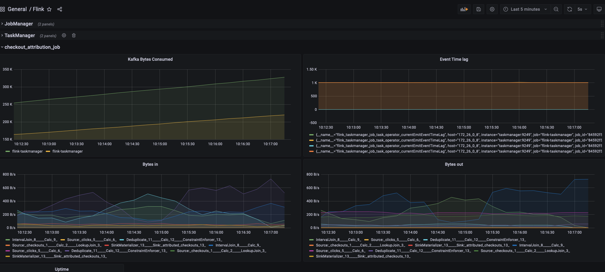
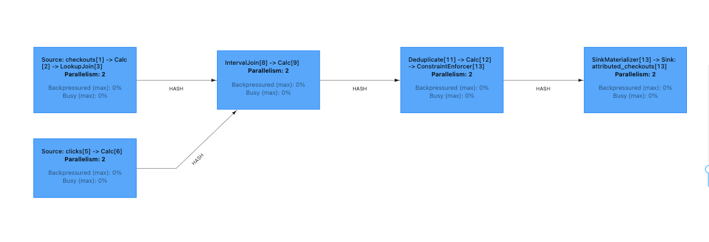

# Beginner Data Engineering Project - Stream Version

For detailed explanation of streaming concepts, see: [Data Engineering Project Stream Edition](https://www.startdataengineering.com/post/data-engineering-project-for-beginners-stream-edition/)

## Design

A common use case for streaming pipelines is to match an event with a previously occured event.

Consider we run an e-commerce website. A common use case with e-commerce is to identify which click lead to a purchase(checkout). In an e-commerce websites, every user's clicks, impressions, and checkouts are tracked. 

Our objectives are:
 1. Identify which click lead to a checkout (aka attributing a checkout). We consider **the first click a user made on a specific product in the last hour to be the click that lead to a checkout** (see [this for definition](https://www.shopify.com/blog/marketing-attribution#3)).
 2. Log the checkouts and their corresponding attributed clicks (if any).
 3. Enrich checkout data with user information. The user data is in a transactional database.

`ADD ARCH IMAGE`


## Setup

We will use Docker to run the required components as containers.

### Prerequisite

1. [git](https://git-scm.com/book/en/v2/Getting-Started-Installing-Git)
2. [Docker](https://docs.docker.com/engine/install/) with at least 4GB of RAM and [Docker Compose](https://docs.docker.com/compose/install/) v1.27.0 or later
3. [psql](https://blog.timescale.com/tutorials/how-to-install-psql-on-mac-ubuntu-debian-windows/)

Run the following commands (via terminal) in your project directory. 

**Note:** If you are using windows please try [WSL](https://ubuntu.com/tutorials/install-ubuntu-on-wsl2-on-windows-10#1-overview) to setup ubuntu and run the following commands via that terminal.

## Run streaming job

Clone and run the streaming job (via terminal) as shown below:

```bash
git clone https://github.com/josephmachado/beginner_de_project_stream
cd beginner_de_project_stream
make run
```
The `make run` command will restart all containers, format code, run lint checks and starts the streaming job.

**Note**: See [Makefile](./Makefile) to see how/what commands are run.

## Monitor cluster usage

A key component of managing always running systems are measuring metrics. For this example we will send metrics data to Prometheus ([Apache Flink Metrics](https://nightlies.apache.org/flink/flink-docs-release-1.17/docs/ops/metrics/)) and make it available via Graphana for visualization.

You can open Graphana using the `make open` or by going to `localhost:3000` via your browser. The username and password are `admin` and `flink` respectively.



## Check output

Once we start the job, it will run asynchronously. We can check the Flink UI (`http://localhost:8081/` or `make ui`) and clicking on `Jobs -> Running Jobs -> checkout-attribution-job` to see our running job.



We can check the output of our job, by looking at the attributed checkouts. 

Open a postgres terminal as shown below.

```bash
pgcli -h localhost -p 5432 -U postgres -d postgres 
# password: postgres
```

Use the below query to check that the output updates every few seconds.

```sql
SELECT checkout_id, click_id, checkout_time, click_time, user_name FROM commerce.attributed_checkouts order by checkout_time desc limit 5;
```

## Tear down 

Use `make down` to spin down the containers.

## Contributing

Contributions are welcome. If you would like to contribute you can help by opening a Github issue or putting up a PR.